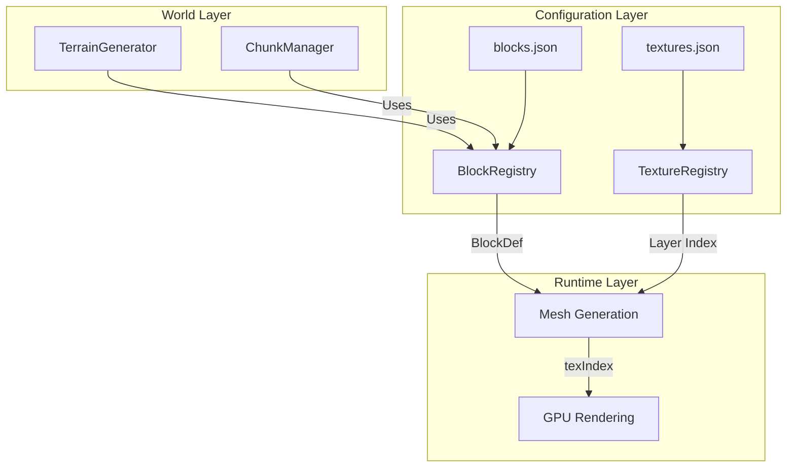

# Phase 11: Scalable Block & Texture Registry System

## Problem Statement

The current block/texture system is **hardcoded** with:

- 5 fixed `BlockType` enum values (Air, Dirt, Grass, Stone, Water)
- 4 hardcoded textures loaded in `Engine.cpp`
- `GetTextureIndex()` using magic numbers in a switch statement
- No way to add new blocks without modifying multiple files

With **1000+ official Minecraft textures** now available in `assets/textures/blocks/`, we need a **modular, data-driven** system.

---

## User Review Required

> [!IMPORTANT] > **Design Decision: JSON Configuration Files**
> The plan uses JSON files for configuration (block definitions, texture mappings). This adds a dependency on a JSON parser library (nlohmann/json). If you prefer a simpler approach (header-only config or compile-time), let me know.

> [!IMPORTANT] > **Block ID System**
> Blocks will be referenced by string IDs (e.g., `"grass_block"`, `"oak_log"`) internally with integer IDs for runtime performance. This matches Minecraft's approach. Confirm this is acceptable.

---

## Architecture Overview



---

## Proposed Changes

### Core Infrastructure

---

#### [NEW] [blocks.json](file:///home/berkay-orhan/Developer/playground/voxel-project/assets/config/blocks.json)

Data-driven block definitions. Each block specifies:

- `id`: String identifier (runtime converts to integer)
- `textures`: Face-specific texture mappings
- `properties`: opacity, solidity, transparency, etc.

```json
{
  "blocks": [
    {
      "id": "air",
      "properties": { "solid": false, "opaque": false, "transparent": false }
    },
    {
      "id": "grass_block",
      "textures": {
        "top": "grass_block_top",
        "bottom": "dirt",
        "sides": "grass_block_side"
      },
      "properties": { "solid": true, "opaque": true, "transparent": false }
    },
    {
      "id": "dirt",
      "textures": { "all": "dirt" },
      "properties": { "solid": true, "opaque": true, "transparent": false }
    },
    {
      "id": "stone",
      "textures": { "all": "stone" },
      "properties": { "solid": true, "opaque": true, "transparent": false }
    },
    {
      "id": "cobblestone",
      "textures": { "all": "cobblestone" },
      "properties": { "solid": true, "opaque": true, "transparent": false }
    },
    {
      "id": "sand",
      "textures": { "all": "sand" },
      "properties": { "solid": true, "opaque": true, "transparent": false }
    },
    {
      "id": "gravel",
      "textures": { "all": "gravel" },
      "properties": { "solid": true, "opaque": true, "transparent": false }
    },
    {
      "id": "oak_log",
      "textures": {
        "top": "oak_log_top",
        "bottom": "oak_log_top",
        "sides": "oak_log"
      },
      "properties": { "solid": true, "opaque": true, "transparent": false }
    },
    {
      "id": "oak_planks",
      "textures": { "all": "oak_planks" },
      "properties": { "solid": true, "opaque": true, "transparent": false }
    },
    {
      "id": "water",
      "textures": { "all": "water_still" },
      "properties": { "solid": false, "opaque": false, "transparent": true }
    }
  ]
}
```

---

#### [NEW] [BlockRegistry.h](file:///home/berkay-orhan/Developer/playground/voxel-project/world/BlockRegistry.h)

Central registry for block definitions:

- Loads blocks from `blocks.json` at startup
- Maps string IDs → integer IDs for runtime
- Provides `GetBlockDef(BlockID)` for properties
- Provides `GetTextureIndex(BlockID, Face)` for mesh generation

```cpp
struct BlockDef {
    uint16_t id;                    // Runtime integer ID
    std::string stringId;           // "grass_block", "oak_log", etc.
    bool solid = true;
    bool opaque = true;
    bool transparent = false;

    // Texture indices per face (populated from TextureRegistry)
    int textureTop = 0;
    int textureBottom = 0;
    int textureSide = 0;            // Used for North/South/East/West
};

class BlockRegistry {
public:
    static BlockRegistry& Instance();

    void LoadFromFile(const std::string& path, TextureRegistry& texRegistry);

    BlockID GetBlockID(const std::string& stringId) const;
    const BlockDef& GetBlockDef(BlockID id) const;
    int GetTextureIndex(BlockID id, Face face) const;

    bool IsOpaque(BlockID id) const;
    bool IsSolid(BlockID id) const;
    bool IsTransparent(BlockID id) const;

private:
    std::vector<BlockDef> m_Blocks;
    std::unordered_map<std::string, BlockID> m_StringToId;
};
```

---

#### [NEW] [TextureRegistry.h](file:///home/berkay-orhan/Developer/playground/voxel-project/core/TextureRegistry.h)

Manages texture name → layer index mapping:

- Scans `assets/textures/blocks/` for available textures
- Assigns layer indices in load order
- Provides `GetLayerIndex("texture_name")` lookup
- Builds the `TextureArray` with all registered textures

```cpp
class TextureRegistry {
public:
    static TextureRegistry& Instance();

    // Load textures from directory, optionally filtering by list
    void LoadFromDirectory(const std::string& directory,
                           const std::vector<std::string>& textureList);

    // Get layer index for a texture name (without .png extension)
    int GetLayerIndex(const std::string& textureName) const;

    // Get the built texture array for binding
    TextureArray& GetTextureArray();

private:
    std::unordered_map<std::string, int> m_NameToLayer;
    std::unique_ptr<TextureArray> m_TextureArray;
};
```

---

#### [MODIFY] [Block.h](file:///home/berkay-orhan/Developer/playground/voxel-project/world/Block.h)

- Replace `BlockType` enum with `using BlockID = uint16_t`
- Keep `Face` enum as-is
- Remove inline functions (`IsOpaque`, `GetTextureIndex`, etc.)
- Functions now delegate to `BlockRegistry::Instance()`

---

#### [MODIFY] [ChunkMeshBuilder.cpp](file:///home/berkay-orhan/Developer/playground/voxel-project/world/ChunkMeshBuilder.cpp)

- Replace `GetTextureIndex(blockType, face)` calls with `BlockRegistry::Instance().GetTextureIndex(blockId, face)`
- Replace `IsOpaque()` with registry lookup

---

#### [MODIFY] [Engine.cpp](file:///home/berkay-orhan/Developer/playground/voxel-project/core/Engine.cpp)

Update `SetupWorld()`:

1. Create `TextureRegistry` and load textures
2. Create `BlockRegistry` and load block definitions
3. Use `TextureRegistry::GetTextureArray()` instead of manual creation

---

#### [MODIFY] [Chunk.h](file:///home/berkay-orhan/Developer/playground/voxel-project/world/Chunk.h)

- Change block storage from `BlockType` to `BlockID` (uint16_t)
- Update `GetBlock()`/`SetBlock()` signatures

---

### Build System

---

#### [MODIFY] [CMakeLists.txt](file:///home/berkay-orhan/Developer/playground/voxel-project/CMakeLists.txt)

Add nlohmann/json dependency via FetchContent:

```cmake
FetchContent_Declare(
    json
    GIT_REPOSITORY https://github.com/nlohmann/json.git
    GIT_TAG v3.11.3
)
FetchContent_MakeAvailable(json)

target_link_libraries(VoxelEngine PRIVATE ... nlohmann_json::nlohmann_json)
```

---

## New Blocks to Add (Phase 11)

With this system in place, we'll immediately add these blocks:

| Block ID      | Textures                     | Notes               |
| ------------- | ---------------------------- | ------------------- |
| `bedrock`     | bedrock.png                  | Y=0 layer           |
| `sand`        | sand.png                     | Beaches, deserts    |
| `gravel`      | gravel.png                   | River beds, caves   |
| `cobblestone` | cobblestone.png              | Cave generation     |
| `oak_log`     | oak_log.png, oak_log_top.png | Trees               |
| `oak_planks`  | oak_planks.png               | Structures          |
| `oak_leaves`  | oak_leaves.png               | Trees (transparent) |
| `coal_ore`    | coal_ore.png                 | Underground         |
| `iron_ore`    | iron_ore.png                 | Underground         |
| `gold_ore`    | gold_ore.png                 | Deep underground    |
| `diamond_ore` | diamond_ore.png              | Very deep           |

---

## Verification Plan

### Automated Tests

1. `cmake --build build` - Verify compilation
2. Run engine and check console for:
   - "BlockRegistry: Loaded N blocks"
   - "TextureRegistry: Loaded N textures"

### Manual Verification

1. Walk around world - existing terrain should render correctly
2. Check that grass still has top/side/bottom textures
3. Verify no visual regression from Phase 10B

---

## Implementation Order

1. **CMakeLists.txt** - Add nlohmann/json dependency
2. **TextureRegistry** - Create and test texture loading
3. **BlockRegistry** - Create and test block definitions
4. **blocks.json** - Define initial blocks
5. **Refactor Block.h** - Switch to BlockID
6. **Refactor Chunk.h** - Update storage type
7. **Refactor ChunkMeshBuilder** - Use registries
8. **Refactor Engine.cpp** - Use new initialization flow
9. **TerrainGenerator** - Update to use BlockID
10. **Add new blocks** - Sand, Gravel, Cobblestone, Ores
