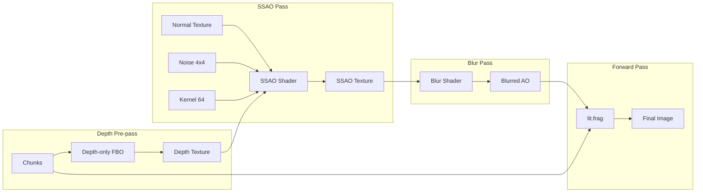
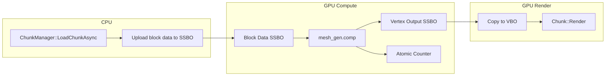

# Phase 16: GPU Optimizations

Implementation plan for SSAO (16A) and Compute Shader Mesh Generation (16B).

> [!NOTE]
> Phase 16C (Compute Shader Terrain Generation) has been **deferred to backlog** due to GPU/CPU noise precision concerns that could cause chunk boundary artifacts.

## Overview

| Phase   | Feature                               | Status                      |
| ------- | ------------------------------------- | --------------------------- |
| **16A** | Screen-Space Ambient Occlusion (SSAO) | 🔜 Ready to implement       |
| **16B** | Compute Shader Mesh Generation        | 🔜 Ready to implement       |
| **16C** | Compute Shader Terrain Generation     | ⏸️ Backlog (precision risk) |

## Key Decisions (From User Discussion)

| Decision           | Choice                                          | Rationale                                         |
| ------------------ | ----------------------------------------------- | ------------------------------------------------- |
| SSAO resolution    | **Half-res**                                    | Faster, still looks good with blur                |
| Rendering approach | **Forward + Depth Pre-pass**                    | Simpler than full deferred, sufficient for SSAO   |
| Vertex AO          | **Keep** (either/or with SSAO)                  | SSAO ON = use SSAO only, SSAO OFF = use vertex AO |
| Phase 16C          | **Deferred**                                    | GPU noise may not match CPU FastNoiseLite exactly |
| Memory budget      | **~50 MB** acceptable for SSBOs                 |
| Key bindings       | **O** = SSAO toggle, **G** = GPU compute toggle |

---

## Phase 16A: Screen-Space Ambient Occlusion (SSAO)

### Architecture: Forward + Depth Pre-pass

Unlike full deferred rendering, we keep the current forward renderer and add:

1. **Depth Pre-pass**: Render scene to depth texture only
2. **Normal Reconstruction**: Derive normals from depth (or add normal texture)
3. **SSAO Pass**: Sample depth hemisphere, output AO texture
4. **Blur Pass**: Smooth AO to remove noise
5. **Final Pass**: Use SSAO texture in lit.frag



### Proposed Changes

---

#### [NEW] [SSAO.h](file:///c:/Users/berka/Project/voxel-project/core/SSAO.h)

SSAO system managing depth pass, kernel, noise, and blur:

```cpp
#pragma once

#include <glm/glm.hpp>
#include <memory>
#include <vector>

namespace Core {

class Shader;

class SSAO {
public:
    SSAO() = default;
    ~SSAO();

    // Initialize SSAO system
    bool Setup(int width, int height);

    // Resize textures when window size changes
    void Resize(int width, int height);

    // Render depth pre-pass (call before SSAO calculation)
    void BeginDepthPass();
    void EndDepthPass();

    // Calculate SSAO from depth buffer
    void Calculate(const glm::mat4& projection, const glm::mat4& view);

    // Bind blurred AO texture for sampling in lit.frag
    void BindAOTexture(int slot);
    void UnbindAOTexture(int slot);

    // Get depth texture for normal reconstruction
    unsigned int GetDepthTexture() const { return m_DepthTexture; }

    // Toggle
    void SetEnabled(bool enabled) { m_Enabled = enabled; }
    bool IsEnabled() const { return m_Enabled; }

    // Accessors for viewport restore
    int GetWidth() const { return m_Width; }
    int GetHeight() const { return m_Height; }

private:
    void GenerateKernel();
    void GenerateNoiseTexture();
    void SetupFullscreenQuad();
    void CleanupFullscreenQuad();

    // Shaders
    std::unique_ptr<Shader> m_DepthShader;
    std::unique_ptr<Shader> m_SSAOShader;
    std::unique_ptr<Shader> m_BlurShader;

    // Depth pre-pass FBO
    unsigned int m_DepthFBO = 0;
    unsigned int m_DepthTexture = 0;
    unsigned int m_NormalTexture = 0;  // View-space normals

    // SSAO FBO (half-resolution)
    unsigned int m_SSAOFBO = 0;
    unsigned int m_SSAOTexture = 0;

    // Blur FBO (half-resolution)
    unsigned int m_BlurFBO = 0;
    unsigned int m_BlurTexture = 0;

    // Noise texture (4x4)
    unsigned int m_NoiseTexture = 0;

    // Sample kernel (64 vectors)
    std::vector<glm::vec3> m_Kernel;

    // Fullscreen quad
    unsigned int m_QuadVAO = 0;
    unsigned int m_QuadVBO = 0;

    // Dimensions
    int m_Width = 0;
    int m_Height = 0;
    int m_SSAOWidth = 0;   // Half of m_Width
    int m_SSAOHeight = 0;  // Half of m_Height

    bool m_Enabled = true;
};

} // namespace Core
```

---

#### [NEW] [depth_normal.vert](file:///c:/Users/berka/Project/voxel-project/assets/shaders/depth_normal.vert)

Vertex shader for depth + normal pre-pass:

```glsl
#version 460 core

layout (location = 0) in vec3 aPos;
layout (location = 2) in vec3 aNormal;

out vec3 ViewNormal;

uniform mat4 u_MVP;
uniform mat4 u_ModelView;  // Model * View (for normal transformation)

void main() {
    gl_Position = u_MVP * vec4(aPos, 1.0);
    // Transform normal to view space
    ViewNormal = normalize(mat3(u_ModelView) * aNormal);
}
```

---

#### [NEW] [depth_normal.frag](file:///c:/Users/berka/Project/voxel-project/assets/shaders/depth_normal.frag)

Fragment shader outputting view-space normal:

```glsl
#version 460 core

in vec3 ViewNormal;

layout (location = 0) out vec3 gNormal;

void main() {
    gNormal = normalize(ViewNormal);
}
```

---

#### [NEW] [ssao.frag](file:///c:/Users/berka/Project/voxel-project/assets/shaders/ssao.frag)

SSAO calculation (half-resolution):

```glsl
#version 460 core

in vec2 TexCoord;
out float FragColor;

uniform sampler2D u_DepthTex;
uniform sampler2D u_NormalTex;
uniform sampler2D u_NoiseTex;

uniform vec3 u_Samples[64];
uniform mat4 u_Projection;
uniform mat4 u_InvProjection;

uniform vec2 u_NoiseScale;  // fullResolution / 4.0
uniform float u_Radius;
uniform float u_Bias;
uniform float u_Power;

// Reconstruct view-space position from depth
vec3 ViewPosFromDepth(vec2 uv, float depth) {
    // NDC position
    vec4 clipPos = vec4(uv * 2.0 - 1.0, depth * 2.0 - 1.0, 1.0);
    // View-space position
    vec4 viewPos = u_InvProjection * clipPos;
    return viewPos.xyz / viewPos.w;
}

void main() {
    float depth = texture(u_DepthTex, TexCoord).r;

    // Skip sky (depth = 1.0)
    if (depth >= 1.0) {
        FragColor = 1.0;
        return;
    }

    vec3 fragPos = ViewPosFromDepth(TexCoord, depth);
    vec3 normal = normalize(texture(u_NormalTex, TexCoord).xyz);
    vec3 randomVec = normalize(texture(u_NoiseTex, TexCoord * u_NoiseScale).xyz);

    // Create TBN matrix
    vec3 tangent = normalize(randomVec - normal * dot(randomVec, normal));
    vec3 bitangent = cross(normal, tangent);
    mat3 TBN = mat3(tangent, bitangent, normal);

    float occlusion = 0.0;
    for (int i = 0; i < 64; ++i) {
        // Sample position in view space
        vec3 samplePos = fragPos + TBN * u_Samples[i] * u_Radius;

        // Project to screen space
        vec4 offset = u_Projection * vec4(samplePos, 1.0);
        offset.xy /= offset.w;
        offset.xy = offset.xy * 0.5 + 0.5;

        // Sample depth at offset
        float sampleDepth = texture(u_DepthTex, offset.xy).r;
        vec3 sampleViewPos = ViewPosFromDepth(offset.xy, sampleDepth);

        // Range check and occlusion test
        float rangeCheck = smoothstep(0.0, 1.0, u_Radius / abs(fragPos.z - sampleViewPos.z));
        occlusion += (sampleViewPos.z >= samplePos.z + u_Bias ? 1.0 : 0.0) * rangeCheck;
    }

    occlusion = 1.0 - (occlusion / 64.0);
    FragColor = pow(occlusion, u_Power);
}
```

---

#### [NEW] [ssao_blur.frag](file:///c:/Users/berka/Project/voxel-project/assets/shaders/ssao_blur.frag)

Box blur for SSAO:

```glsl
#version 460 core

in vec2 TexCoord;
out float FragColor;

uniform sampler2D u_SSAOTex;

void main() {
    vec2 texelSize = 1.0 / vec2(textureSize(u_SSAOTex, 0));
    float result = 0.0;

    for (int x = -2; x <= 2; ++x) {
        for (int y = -2; y <= 2; ++y) {
            vec2 offset = vec2(float(x), float(y)) * texelSize;
            result += texture(u_SSAOTex, TexCoord + offset).r;
        }
    }

    FragColor = result / 25.0;
}
```

---

#### [NEW] [fullscreen.vert](file:///c:/Users/berka/Project/voxel-project/assets/shaders/fullscreen.vert)

Reusable fullscreen quad vertex shader:

```glsl
#version 460 core

layout (location = 0) in vec2 aPos;
layout (location = 1) in vec2 aTexCoord;

out vec2 TexCoord;

void main() {
    gl_Position = vec4(aPos, 0.0, 1.0);
    TexCoord = aTexCoord;
}
```

---

#### [MODIFY] [lit.frag](file:///c:/Users/berka/Project/voxel-project/assets/shaders/lit.frag)

Add SSAO sampling with either/or logic:

```diff
+// SSAO uniforms
+uniform sampler2D u_SSAOTex;
+uniform bool u_SSAOEnabled;
+uniform vec2 u_ScreenSize;

 void main() {
     // ... existing texture/lighting code ...

-    // Combine ambient + diffuse * shadow, modulated by ambient occlusion
-    float lighting = (u_AmbientStrength + (1.0 - u_AmbientStrength) * diff * shadow) * AO;
+    // Select AO source: SSAO (screen-space) or vertex AO
+    float ao = AO;  // Default to vertex AO
+    if (u_SSAOEnabled) {
+        vec2 screenUV = gl_FragCoord.xy / u_ScreenSize;
+        ao = texture(u_SSAOTex, screenUV).r;
+    }
+
+    // Combine ambient + diffuse * shadow, modulated by AO
+    float lighting = (u_AmbientStrength + (1.0 - u_AmbientStrength) * diff * shadow) * ao;
```

---

#### [MODIFY] [Engine.cpp](file:///c:/Users/berka/Project/voxel-project/core/Engine.cpp)

Add SSAO render passes:

```diff
+#include "core/SSAO.h"

 // New member
+std::unique_ptr<SSAO> m_SSAO;

 void Engine::SetupWorld() {
+    // Create SSAO system
+    m_SSAO = std::make_unique<SSAO>();
+    if (!m_SSAO->Setup(m_Window->GetWidth(), m_Window->GetHeight())) {
+        LOG_WARNING("SSAO setup failed, disabling");
+        m_SSAO.reset();
+    }
     // ...
 }

 void Engine::ProcessInput(float deltaTime) {
+    // Toggle SSAO with O key
+    static bool oKeyWasPressed = false;
+    if (glfwGetKey(window, GLFW_KEY_O) == GLFW_PRESS) {
+        if (!oKeyWasPressed && m_SSAO) {
+            oKeyWasPressed = true;
+            m_SSAO->SetEnabled(!m_SSAO->IsEnabled());
+            LOG_INFO(m_SSAO->IsEnabled() ? "SSAO enabled" : "SSAO disabled");
+        }
+    } else {
+        oKeyWasPressed = false;
+    }
     // ...
 }

 void Engine::Render() {
+    bool useSSAO = m_SSAO && m_SSAO->IsEnabled();
+
+    // === SSAO DEPTH PRE-PASS ===
+    if (useSSAO) {
+        m_SSAO->BeginDepthPass();
+        // Render all chunks with depth+normal shader
+        m_ChunkManager->RenderAllDepth(*m_SSAO->GetDepthShader(), *m_Camera, aspectRatio);
+        m_SSAO->EndDepthPass();
+
+        // Calculate SSAO
+        m_SSAO->Calculate(projection, view);
+    }
+
     // ... existing shadow pass ...

+    // Bind SSAO texture for lit.frag
+    if (useSSAO) {
+        m_SSAO->BindAOTexture(2);  // Slot 2
+    }
+
     m_Shader->Bind();
+    m_Shader->SetBool("u_SSAOEnabled", useSSAO);
+    m_Shader->SetVec2("u_ScreenSize", glm::vec2(m_Window->GetWidth(), m_Window->GetHeight()));
     // ... rest of rendering ...
+
+    if (useSSAO) {
+        m_SSAO->UnbindAOTexture(2);
+    }
 }
```

---

#### [MODIFY] [WorldConfig.h](file:///c:/Users/berka/Project/voxel-project/world/WorldConfig.h)

Add SSAO configuration:

```cpp
// =============================================================================
// SSAO (Screen-Space Ambient Occlusion)
// =============================================================================

constexpr bool  SSAO_ENABLED       = true;   // Enable by default
constexpr int   SSAO_KERNEL_SIZE   = 64;     // Number of hemisphere samples
constexpr float SSAO_RADIUS        = 0.5f;   // Sampling radius (world units)
constexpr float SSAO_BIAS          = 0.025f; // Depth bias to prevent self-occlusion
constexpr float SSAO_POWER         = 2.0f;   // Contrast (higher = stronger AO)
```

---

### Phase 16A File Summary

| File                               | Action | Description                    |
| ---------------------------------- | ------ | ------------------------------ |
| `core/SSAO.h`                      | NEW    | SSAO system header             |
| `core/SSAO.cpp`                    | NEW    | SSAO implementation            |
| `assets/shaders/depth_normal.vert` | NEW    | Depth pre-pass vertex shader   |
| `assets/shaders/depth_normal.frag` | NEW    | Depth pre-pass fragment shader |
| `assets/shaders/fullscreen.vert`   | NEW    | Fullscreen quad vertex shader  |
| `assets/shaders/ssao.frag`         | NEW    | SSAO calculation               |
| `assets/shaders/ssao_blur.frag`    | NEW    | SSAO blur pass                 |
| `assets/shaders/lit.frag`          | MODIFY | Add SSAO sampling              |
| `core/Engine.h`                    | MODIFY | Add SSAO member                |
| `core/Engine.cpp`                  | MODIFY | Add SSAO render passes         |
| `world/WorldConfig.h`              | MODIFY | Add SSAO config                |
| `CMakeLists.txt`                   | MODIFY | Add SSAO.cpp                   |

---

## Phase 16B: Compute Shader Mesh Generation

### Architecture



### Proposed Changes

---

#### [NEW] [ComputeMesher.h](file:///c:/Users/berka/Project/voxel-project/core/ComputeMesher.h)

GPU mesh generation system:

```cpp
#pragma once

#include <memory>
#include <glm/glm.hpp>

namespace Voxel {
class Chunk;
}

namespace Core {

class Shader;

class ComputeMesher {
public:
    ComputeMesher() = default;
    ~ComputeMesher();

    // Initialize compute shader and SSBOs
    bool Setup();

    // Generate mesh for a chunk on GPU
    // Returns immediately, mesh ready next frame
    void DispatchMeshGeneration(const Voxel::Chunk& chunk, int chunkX, int chunkZ);

    // Check if mesh is ready and get vertex count
    bool IsMeshReady(uint32_t& opaqueVertexCount, uint32_t& waterVertexCount);

    // Copy generated mesh data to chunk's VBO
    void UploadToChunk(Voxel::Chunk& chunk);

    // Toggle compute meshing (for A/B testing)
    void SetEnabled(bool enabled) { m_Enabled = enabled; }
    bool IsEnabled() const { return m_Enabled; }

private:
    void SetupBlockLookupTable();

    std::unique_ptr<Shader> m_ComputeShader;

    // SSBOs
    unsigned int m_BlockDataSSBO = 0;        // Input: 65536 uint16_t
    unsigned int m_OpaqueVertexSSBO = 0;     // Output: opaque vertices
    unsigned int m_WaterVertexSSBO = 0;      // Output: water vertices
    unsigned int m_BlockLookupSSBO = 0;      // Block properties table

    // Atomic counters
    unsigned int m_AtomicCounterBuffer = 0;

    // Current chunk being processed
    int m_CurrentChunkX = 0;
    int m_CurrentChunkZ = 0;
    bool m_HasPendingMesh = false;

    bool m_Enabled = true;
};

} // namespace Core
```

---

#### [NEW] [mesh_gen.comp](file:///c:/Users/berka/Project/voxel-project/assets/shaders/mesh_gen.comp)

Compute shader for mesh generation:

```glsl
#version 460 core

layout (local_size_x = 4, local_size_y = 16, local_size_z = 4) in;

// Input: Block IDs (16x16x256 = 65536)
layout (std430, binding = 0) readonly buffer BlockData {
    uint blocks[];  // Packed as uint16, read as uint32 pairs
};

// Output: Opaque vertices (13 floats per vertex: pos3, uv2, norm3, ao1, texIdx1, tint3)
layout (std430, binding = 1) writeonly buffer OpaqueVertices {
    float opaqueVerts[];
};

// Output: Water vertices (same layout)
layout (std430, binding = 2) writeonly buffer WaterVertices {
    float waterVerts[];
};

// Block lookup table: per-block texture indices and flags
// Each entry: uvec4(topTex, sideTex, bottomTex, flags)
// flags: bit 0 = isOpaque, bit 1 = isTransparent
layout (std430, binding = 3) readonly buffer BlockLookup {
    uvec4 blockInfo[];
};

// Atomic counters for vertex output positions
layout (binding = 0, offset = 0) uniform atomic_uint opaqueCounter;
layout (binding = 0, offset = 4) uniform atomic_uint waterCounter;

uniform ivec2 u_ChunkPos;

// Constants
const int WIDTH = 16;
const int DEPTH = 16;
const int HEIGHT = 256;

// Get block at local position
uint GetBlock(int x, int y, int z) {
    if (x < 0 || x >= WIDTH || y < 0 || y >= HEIGHT || z < 0 || z >= DEPTH) {
        return 0u;  // Air for out-of-bounds
    }
    int idx = y * (WIDTH * DEPTH) + z * WIDTH + x;
    // Blocks stored as uint16, packed in uint32
    uint packed = blocks[idx / 2];
    return (idx % 2 == 0) ? (packed & 0xFFFFu) : (packed >> 16);
}

bool IsOpaque(uint blockId) {
    return (blockInfo[blockId].w & 1u) != 0u;
}

bool IsTransparent(uint blockId) {
    return (blockInfo[blockId].w & 2u) != 0u;
}

// AO calculation (matches CPU implementation)
float CalculateAO(bool side1, bool side2, bool corner) {
    if (side1 && side2) return 0.2;
    int occluders = (side1 ? 1 : 0) + (side2 ? 1 : 0) + (corner ? 1 : 0);
    return 1.0 - float(occluders) * 0.25 + 0.05;
}

// Emit a quad (4 vertices, called once per visible face)
void EmitQuad(bool isWater, vec3 v0, vec3 v1, vec3 v2, vec3 v3,
              vec2 uv0, vec2 uv1, vec2 uv2, vec2 uv3,
              vec3 normal, float ao0, float ao1, float ao2, float ao3,
              float texIdx, vec3 tint) {
    // Get output buffer and counter
    uint vertexBase;
    if (isWater) {
        vertexBase = atomicCounterAdd(waterCounter, 4u);
    } else {
        vertexBase = atomicCounterAdd(opaqueCounter, 4u);
    }

    // Write 4 vertices (13 floats each = 52 bytes per vertex)
    uint offset = vertexBase * 13u;

    if (isWater) {
        // Vertex 0
        waterVerts[offset + 0] = v0.x; waterVerts[offset + 1] = v0.y; waterVerts[offset + 2] = v0.z;
        waterVerts[offset + 3] = uv0.x; waterVerts[offset + 4] = uv0.y;
        waterVerts[offset + 5] = normal.x; waterVerts[offset + 6] = normal.y; waterVerts[offset + 7] = normal.z;
        waterVerts[offset + 8] = ao0; waterVerts[offset + 9] = texIdx;
        waterVerts[offset + 10] = tint.x; waterVerts[offset + 11] = tint.y; waterVerts[offset + 12] = tint.z;
        // ... vertices 1, 2, 3 similarly
    } else {
        // Same for opaque
        opaqueVerts[offset + 0] = v0.x; // ... etc
    }
}

void main() {
    ivec3 pos = ivec3(gl_GlobalInvocationID);

    if (pos.x >= WIDTH || pos.y >= HEIGHT || pos.z >= DEPTH) return;

    uint blockId = GetBlock(pos.x, pos.y, pos.z);
    if (blockId == 0u) return;  // Skip air

    bool isWater = IsTransparent(blockId);
    vec3 worldPos = vec3(u_ChunkPos.x * WIDTH + pos.x, pos.y, u_ChunkPos.y * DEPTH + pos.z);

    // Check each face
    // Top (+Y)
    uint neighborTop = GetBlock(pos.x, pos.y + 1, pos.z);
    if (isWater ? (neighborTop == 0u) : !IsOpaque(neighborTop)) {
        // Calculate AO for 4 corners
        float ao0 = CalculateAO(
            IsOpaque(GetBlock(pos.x - 1, pos.y + 1, pos.z)),
            IsOpaque(GetBlock(pos.x, pos.y + 1, pos.z - 1)),
            IsOpaque(GetBlock(pos.x - 1, pos.y + 1, pos.z - 1))
        );
        // ... ao1, ao2, ao3 for other corners

        float texIdx = float(blockInfo[blockId].x);  // Top texture
        vec3 tint = vec3(1.0);  // TODO: biome tint

        EmitQuad(isWater,
            worldPos + vec3(0, 1, 0), worldPos + vec3(0, 1, 1),
            worldPos + vec3(1, 1, 1), worldPos + vec3(1, 1, 0),
            vec2(0, 0), vec2(0, 1), vec2(1, 1), vec2(1, 0),
            vec3(0, 1, 0), ao0, ao1, ao2, ao3, texIdx, tint
        );
    }

    // ... repeat for other 5 faces (Bottom, North, South, East, West)
}
```

---

#### [MODIFY] [ChunkManager.h](file:///c:/Users/berka/Project/voxel-project/world/ChunkManager.h)

Add compute mesher:

```diff
+#include <memory>
+
+namespace Core {
+class ComputeMesher;
+}

 class ChunkManager {
 public:
+    void SetUseComputeMeshing(bool use) { m_UseComputeMeshing = use; }
+    bool IsUsingComputeMeshing() const { return m_UseComputeMeshing; }
+
 private:
+    std::unique_ptr<Core::ComputeMesher> m_ComputeMesher;
+    bool m_UseComputeMeshing = true;
 };
```

---

#### [MODIFY] [ChunkManager.cpp](file:///c:/Users/berka/Project/voxel-project/world/ChunkManager.cpp)

Integrate compute meshing path:

```diff
+#include "core/ComputeMesher.h"

 ChunkManager::ChunkManager() {
+    // Initialize compute mesher
+    m_ComputeMesher = std::make_unique<Core::ComputeMesher>();
+    if (!m_ComputeMesher->Setup()) {
+        LOG_WARNING("Compute mesher setup failed, using CPU fallback");
+        m_UseComputeMeshing = false;
+    }
     // ...
 }

 void ChunkManager::LoadChunkAsync(int chunkX, int chunkZ) {
+    if (m_UseComputeMeshing && m_ComputeMesher) {
+        // GPU path: dispatch compute shader
+        m_ComputeMesher->DispatchMeshGeneration(*chunk, chunkX, chunkZ);
+        chunk->SetState(ChunkState::Meshing);
+        return;
+    }
+
     // Existing CPU thread pool path (fallback)
     // ...
 }
```

---

### Phase 16B File Summary

| File                           | Action | Description                     |
| ------------------------------ | ------ | ------------------------------- |
| `core/ComputeMesher.h`         | NEW    | Compute mesh gen header         |
| `core/ComputeMesher.cpp`       | NEW    | Compute mesh gen implementation |
| `assets/shaders/mesh_gen.comp` | NEW    | Mesh generation compute shader  |
| `world/ChunkManager.h`         | MODIFY | Add ComputeMesher member        |
| `world/ChunkManager.cpp`       | MODIFY | Integrate compute path          |
| `core/Engine.cpp`              | MODIFY | Add G key toggle                |
| `world/WorldConfig.h`          | MODIFY | Add compute mesh config         |
| `CMakeLists.txt`               | MODIFY | Add ComputeMesher.cpp           |

---

## Verification Plan

### Phase 16A: SSAO

**Build & Run:**

```bash
cmake --build build --config Release
./build/Release/VoxelGame.exe
```

**Visual Checks:**

- [ ] Corners show subtle darkening
- [ ] No visible banding or noise
- [ ] `O` key toggles SSAO on/off
- [ ] Performance acceptable (>30 FPS)
- [ ] Vertex AO works when SSAO is off

### Phase 16B: Compute Mesh

**Visual Checks:**

- [ ] Meshes identical to CPU-generated
- [ ] No missing faces
- [ ] `G` key toggles CPU/GPU meshing
- [ ] Performance improvement measurable (compare chunk load times)

---

## Phase 16C: Compute Terrain Generation (Backlog)

> [!WARNING]
> Deferred due to GPU/CPU noise precision concerns that could cause chunk boundary artifacts.

If implemented in future:

- Implement GPU Perlin/Cellular noise
- Validate output matches FastNoiseLite exactly
- Test chunk boundary alignment

---

## Timeline

| Phase                  | Estimated Effort | Dependencies     |
| ---------------------- | ---------------- | ---------------- |
| **16A (SSAO)**         | 2-3 hours        | None             |
| **16B (Compute Mesh)** | 3-4 hours        | 16A not required |

Implementation order: **16A → 16B** (SSAO first as it's simpler and self-contained)
