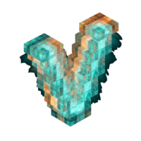
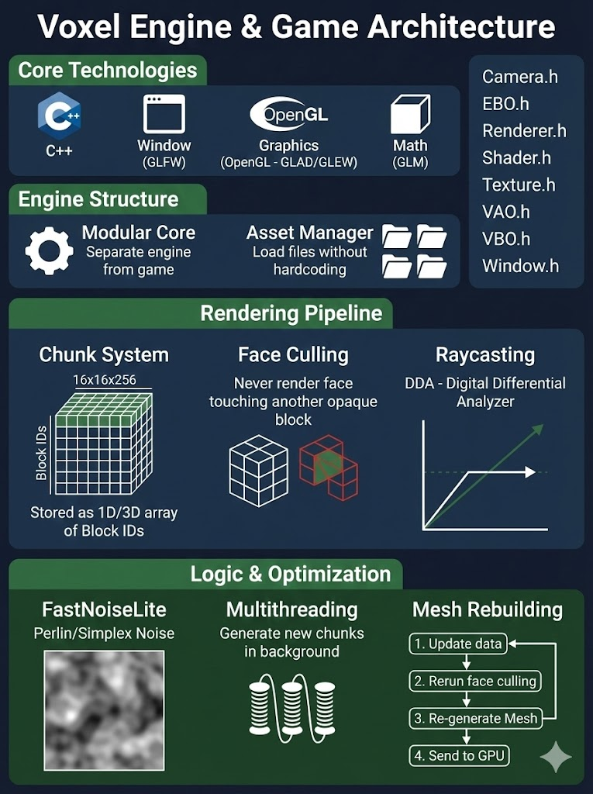

<div align="center">



# Voxel Engine

**A high-performance C++20 Voxel Game Engine built from scratch.**

</div>

## Overview



This project is a custom game engine tailored for voxel-based rendering and gameplay, inspired by Minecraft. It is built using modern C++20 and focuses on performance, modularity, and clean architecture.

The engine features a modular core decoupled from game logic, a centralized configuration system, and optimized rendering techniques like aggressive face culling and multithreaded chunk generation.

### Key Features

- **Modern C++20 Architecture**: Modular design with organized subdirectories:
  - `core/` - Engine subsystems (graphics, rendering, scene, atmosphere, settings)
  - `world/` - Game logic and voxel systems
  - `ui/` - User interface components
- **High-Performance Rendering**:
  - OpenGL 4.6 Core Profile.
  - Aggressive Face Culling (internal faces are never rendered).
  - Frustum Culling for optimized rendering.
  - Multithreaded Chunk Generation and Meshing.
- **Dynamic World**:
  - Infinite procedural terrain using 3D Perlin Noise (FastNoiseLite).
  - Biome System (Plains, Mountains) with smooth transitions.
  - Cave Systems: Spaghetti caves with natural entrances and water flooding.
  - Destructible Terrain: Raycast-based block breaking and placing.
- **Visuals**:
  - Dynamic Day/Night Cycle with celestial bodies (Sun/Moon with lunar phases).
  - Directional Lighting with Per-Vertex Ambient Occlusion (AO).
  - Screen-Space Ambient Occlusion (SSAO) for enhanced depth.
  - Shadow Mapping with stabilized cascades.
  - Transparent Water rendering with proper blending.
  - Volumetric Clouds (Fast 2D / Fancy 3D modes).
  - Distance Fog for atmospheric depth.
  - Weather System (Rain/Snow particles).

## Demo

### Surface Exploration

<div align="center">


</div>

### Cave Generation

<div align="center">


</div>

## Tech Stack

- **Language**: C++20
- **Build System**: CMake 3.28+
- **Windowing/Input**: GLFW 3.4
- **Graphics API**: OpenGL 4.6
- **Loaders**: GLAD
- **Math**: GLM 1.0.1
- **Noise**: FastNoiseLite 1.1.1
- **Image Loading**: stb_image
- **JSON**: nlohmann/json

## Getting Started

### Prerequisites

- C++20 compatible compiler (GCC, Clang, MSVC)
- CMake 3.28 or higher
- OpenGL 4.6 capabilities

### Build Instructions

```bash
# Clone the repository
git clone https://github.com/berkay2002/voxel-project.git
cd voxel-project

# Configure the project
cmake -B build -S .

# Build the project
cmake --build build -j$(nproc)
```

### Running

```bash
./build/VoxelEngine
```

## Controls

- **WASD**: Move Camera
- **Mouse**: Look Around
- **M**: Toggle Mouse Capture
- **Left Click**: Break Block
- **Right Click**: Place Block
- **Shift**: Sprint / Fly Down
- **Space**: Jump / Fly Up
- **K**: Toggle Weather (Rain/Snow)
- **O**: Toggle SSAO
- **H/J**: Rewind/Fast-forward Time
- **Esc**: Close Application

## License

This project is open source and available under the [MIT License](LICENSE).
